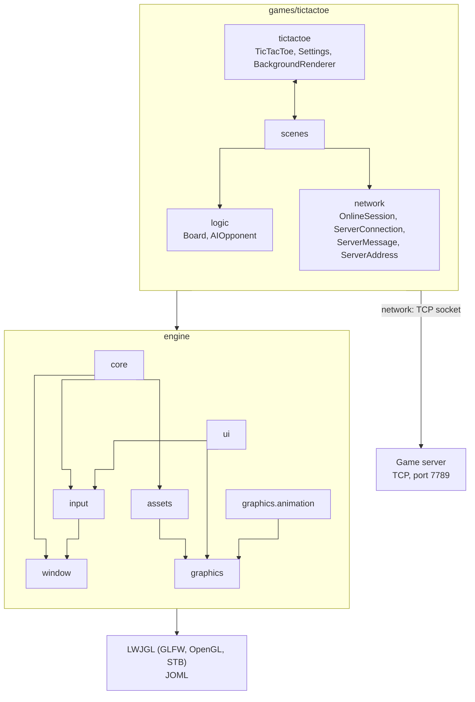

# Architecture

```mermaid
%%{init: {"flowchart": {"curve": "stepAfter"}}}%%
flowchart TB
    subgraph game ["games/tictactoe"]
        direction TB
        root["tictactoe<br/>TicTacToe, Settings, BackgroundRenderer"]
        scenes["scenes"]
        logic["logic<br/>Board, AIOpponent"]
        network["network<br/>OnlineSession, ServerConnection,<br/>ServerMessage, ServerAddress"]
        root <--> scenes
        scenes --> logic
        scenes --> network
    end

    subgraph engine ["engine"]
        direction TB
        core["core"]
        input["input"]
        window["window"]
        ui["ui"]
        assets["assets"]
        graphics["graphics"]
        animation["graphics.animation"]
        core --> window
        core --> input
        input --> window
        core --> assets
        assets --> graphics
        ui --> input
        ui --> graphics
        animation --> graphics
        core ~~~ ui
        ui ~~~ animation
    end

    server["Game server<br/>TCP, port 7789"]
    libs["LWJGL (GLFW, OpenGL, STB)<br/>JOML"]

    game --> engine
    game -->|"network: TCP socket"| server
    engine --> libs
```
