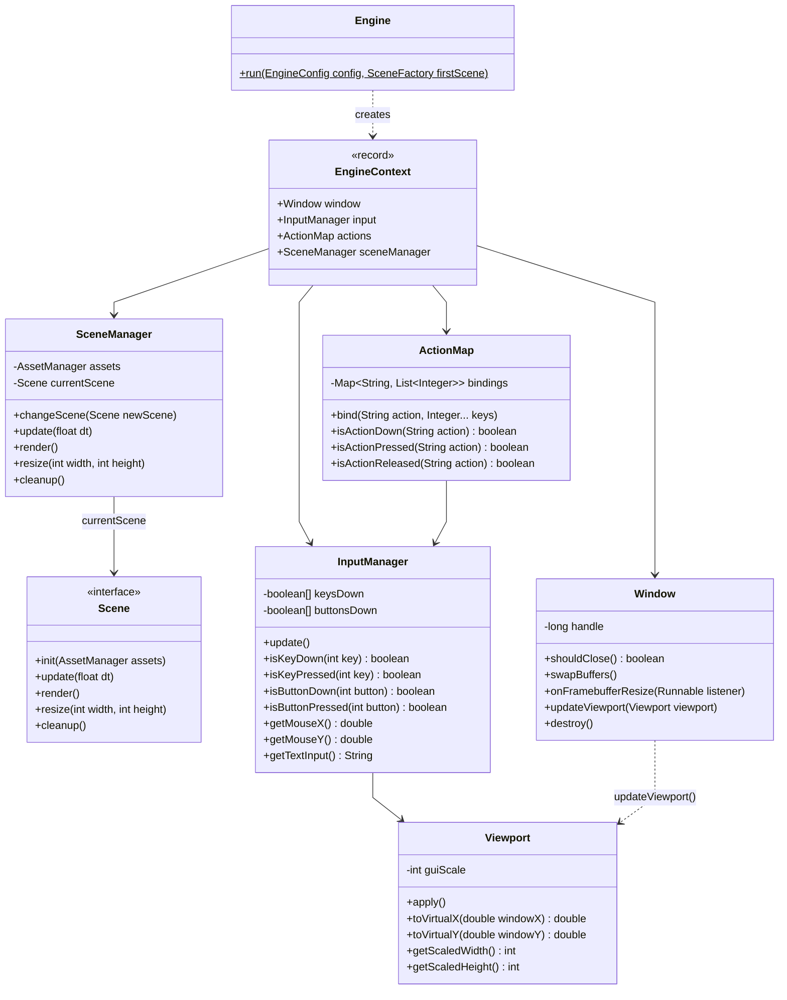

# Class diagram: core

```mermaid
%%{init: {"flowchart": {"curve": "linear"}}}%%
classDiagram
    direction TB
    class Engine {
        +run(EngineConfig config, SceneFactory firstScene)$
    }
    class EngineContext {
        <<record>>
        +Window window
        +InputManager input
        +ActionMap actions
        +SceneManager sceneManager
    }
    class SceneManager {
        -AssetManager assets
        -Scene currentScene
        +changeScene(Scene newScene)
        +update(float dt)
        +render()
        +resize(int width, int height)
        +cleanup()
    }
    class Scene {
        <<interface>>
        +init(AssetManager assets)
        +update(float dt)
        +render()
        +resize(int width, int height)
        +cleanup()
    }
    class ActionMap {
        -Map#lt;String, List#lt;Integer#gt;#gt; bindings
        +bind(String action, Integer... keys)
        +isActionDown(String action) boolean
        +isActionPressed(String action) boolean
        +isActionReleased(String action) boolean
    }
    class InputManager {
        -boolean[] keysDown
        -boolean[] buttonsDown
        +update()
        +isKeyDown(int key) boolean
        +isKeyPressed(int key) boolean
        +isButtonDown(int button) boolean
        +isButtonPressed(int button) boolean
        +getMouseX() double
        +getMouseY() double
        +getTextInput() String
    }
    class Window {
        -long handle
        +shouldClose() boolean
        +swapBuffers()
        +onFramebufferResize(Runnable listener)
        +updateViewport(Viewport viewport)
        +destroy()
    }
    class Viewport {
        -int guiScale
        +apply()
        +toVirtualX(double windowX) double
        +toVirtualY(double windowY) double
        +getScaledWidth() int
        +getScaledHeight() int
    }

    Engine ..> EngineContext : creates
    EngineContext --> SceneManager
    EngineContext --> ActionMap
    EngineContext --> InputManager
    EngineContext --> Window
    SceneManager --> Scene : currentScene
    ActionMap --> InputManager
    InputManager --> Viewport
    Window ..> Viewport : updateViewport()
```
