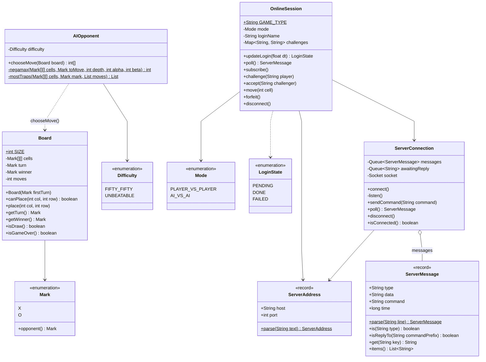

# Class diagram: game

```mermaid
%%{init: {"flowchart": {"curve": "linear"}}}%%
classDiagram
    direction TB
    class Board {
        +int SIZE$
        -Mark[][] cells
        -Mark turn
        -Mark winner
        -int moves
        +Board(Mark firstTurn)
        +canPlace(int col, int row) boolean
        +place(int col, int row)
        +getTurn() Mark
        +getWinner() Mark
        +isDraw() boolean
        +isGameOver() boolean
    }
    class Mark {
        <<enumeration>>
        X
        O
        +opponent() Mark
    }
    class AIOpponent {
        -Difficulty difficulty
        +chooseMove(Board board) int[]
        -negamax(Mark[][] cells, Mark toMove, int depth, int alpha, int beta)$ int
        -mostTraps(Mark[][] cells, Mark mark, List moves)$ List
    }
    class Difficulty {
        <<enumeration>>
        FIFTY_FIFTY
        UNBEATABLE
    }

    class OnlineSession {
        +String GAME_TYPE$
        -Mode mode
        -String loginName
        -Map~String, String~ challenges
        +updateLogin(float dt) LoginState
        +poll() ServerMessage
        +subscribe()
        +challenge(String player)
        +accept(String challenger)
        +move(int cell)
        +forfeit()
        +disconnect()
    }
    class Mode {
        <<enumeration>>
        PLAYER_VS_PLAYER
        AI_VS_AI
    }
    class LoginState {
        <<enumeration>>
        PENDING
        DONE
        FAILED
    }
    class ServerConnection {
        -Queue~ServerMessage~ messages
        -Queue~String~ awaitingReply
        -Socket socket
        +connect()
        -listen()
        +sendCommand(String command)
        +poll() ServerMessage
        +disconnect()
        +isConnected() boolean
    }
    class ServerMessage {
        <<record>>
        +String type
        +String data
        +String command
        +long time
        +parse(String line)$ ServerMessage
        +is(String type) boolean
        +isReplyTo(String commandPrefix) boolean
        +get(String key) String
        +items() List~String~
    }
    class ServerAddress {
        <<record>>
        +String host
        +int port
        +parse(String text)$ ServerAddress
    }

    Board --> Mark
    AIOpponent ..> Board : chooseMove()
    AIOpponent --> Difficulty
    OnlineSession --> ServerConnection
    OnlineSession --> Mode
    OnlineSession ..> LoginState
    OnlineSession --> ServerAddress
    ServerConnection --> ServerAddress
    ServerConnection o-- ServerMessage : messages
```
