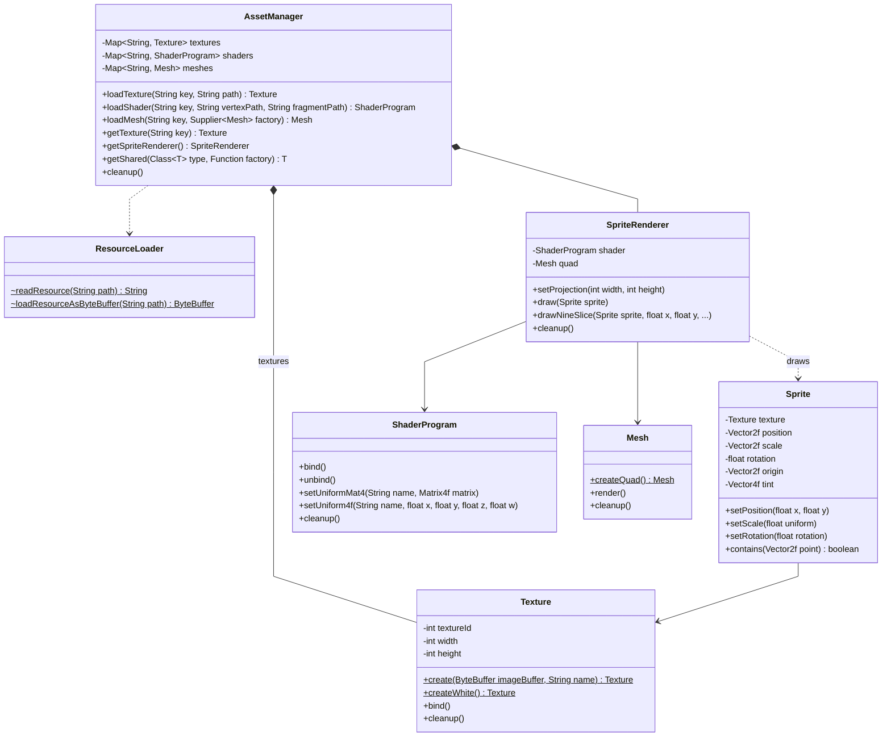
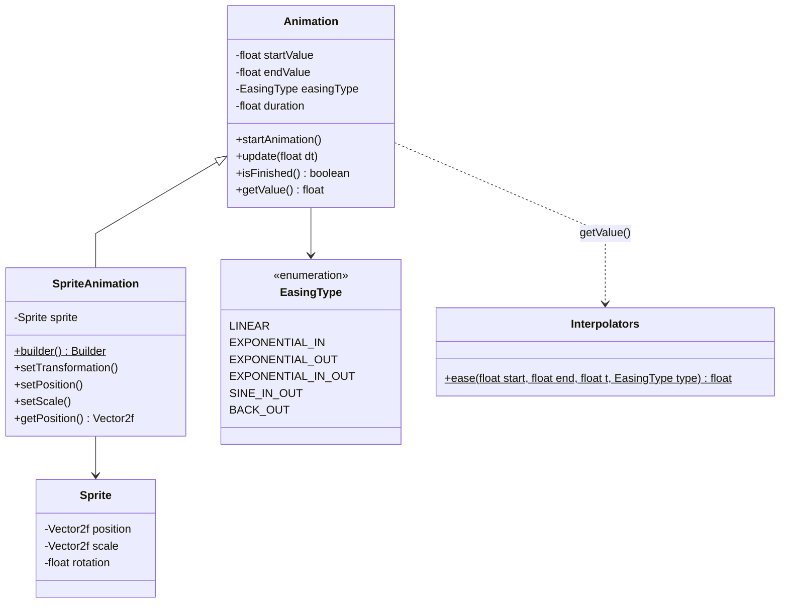

# Class diagram: graphics

## Assets and sprites

```mermaid
%%{init: {"flowchart": {"curve": "linear"}}}%%
classDiagram
    direction TB
    class AssetManager {
        -Map~String, Texture~ textures
        -Map~String, ShaderProgram~ shaders
        -Map~String, Mesh~ meshes
        +loadTexture(String key, String path) Texture
        +loadShader(String key, String vertexPath, String fragmentPath) ShaderProgram
        +loadMesh(String key, Supplier~Mesh~ factory) Mesh
        +getTexture(String key) Texture
        +getSpriteRenderer() SpriteRenderer
        +getShared(Class~T~ type, Function factory) T
        +cleanup()
    }
    class ResourceLoader {
        ~readResource(String path)$ String
        ~loadResourceAsByteBuffer(String path)$ ByteBuffer
    }
    class SpriteRenderer {
        -ShaderProgram shader
        -Mesh quad
        +setProjection(int width, int height)
        +draw(Sprite sprite)
        +drawNineSlice(Sprite sprite, float x, float y, ...)
        +cleanup()
    }
    class ShaderProgram {
        +bind()
        +unbind()
        +setUniformMat4(String name, Matrix4f matrix)
        +setUniform4f(String name, float x, float y, float z, float w)
        +cleanup()
    }
    class Mesh {
        +createQuad()$ Mesh
        +render()
        +cleanup()
    }
    class Texture {
        -int textureId
        -int width
        -int height
        +create(ByteBuffer imageBuffer, String name)$ Texture
        +createWhite()$ Texture
        +bind()
        +cleanup()
    }
    class Sprite {
        -Texture texture
        -Vector2f position
        -Vector2f scale
        -float rotation
        -Vector2f origin
        -Vector4f tint
        +setPosition(float x, float y)
        +setScale(float uniform)
        +setRotation(float rotation)
        +contains(Vector2f point) boolean
    }

    AssetManager ..> ResourceLoader
    AssetManager *-- Texture : textures
    AssetManager *-- SpriteRenderer
    SpriteRenderer --> ShaderProgram
    SpriteRenderer --> Mesh
    SpriteRenderer ..> Sprite : draws
    Sprite --> Texture
```

## Animation

```mermaid
%%{init: {"flowchart": {"curve": "linear"}}}%%
classDiagram
    direction TB
    class Animation {
        -float startValue
        -float endValue
        -EasingType easingType
        -float duration
        +startAnimation()
        +update(float dt)
        +isFinished() boolean
        +getValue() float
    }
    class SpriteAnimation {
        -Sprite sprite
        +builder()$ Builder
        +setTransformation()
        +setPosition()
        +setScale()
        +getPosition() Vector2f
    }
    class EasingType {
        <<enumeration>>
        LINEAR
        EXPONENTIAL_IN
        EXPONENTIAL_OUT
        EXPONENTIAL_IN_OUT
        SINE_IN_OUT
        BACK_OUT
    }
    class Interpolators {
        +ease(float start, float end, float t, EasingType type)$ float
    }

    class Sprite {
        -Vector2f position
        -Vector2f scale
        -float rotation
    }

    Animation <|-- SpriteAnimation
    SpriteAnimation --> Sprite
    Animation --> EasingType
    Animation ..> Interpolators : getValue()
```
