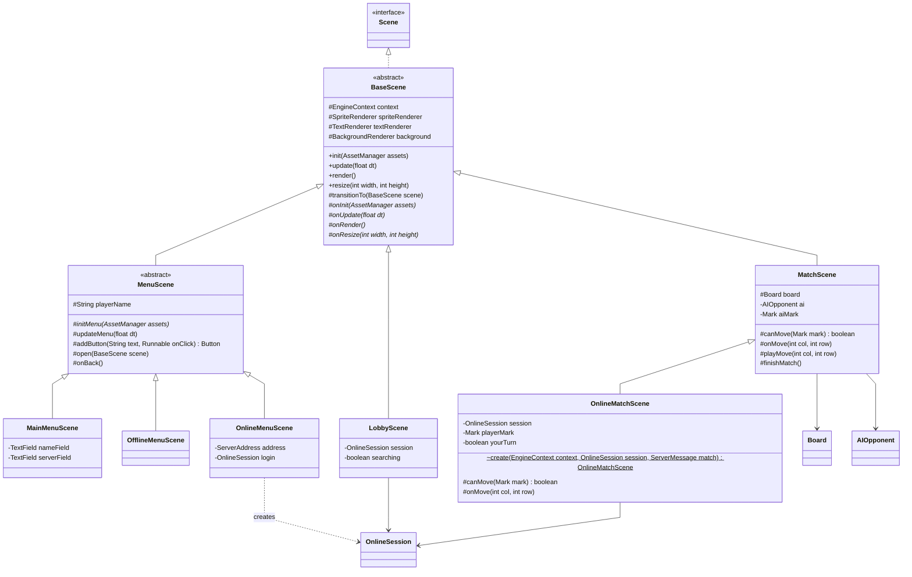
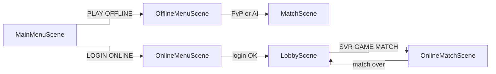

# Class diagram: scenes

## Classes

```mermaid
%%{init: {"flowchart": {"curve": "linear"}}}%%
classDiagram
    direction TB
    class Scene {
        <<interface>>
    }
    class BaseScene {
        <<abstract>>
        #EngineContext context
        #SpriteRenderer spriteRenderer
        #TextRenderer textRenderer
        #BackgroundRenderer background
        +init(AssetManager assets)
        +update(float dt)
        +render()
        +resize(int width, int height)
        #transitionTo(BaseScene scene)
        #onInit(AssetManager assets)*
        #onUpdate(float dt)*
        #onRender()*
        #onResize(int width, int height)*
    }
    class MenuScene {
        <<abstract>>
        #String playerName
        #initMenu(AssetManager assets)*
        #updateMenu(float dt)
        #addButton(String text, Runnable onClick) Button
        #open(BaseScene scene)
        #onBack()
    }
    class MainMenuScene {
        -TextField nameField
        -TextField serverField
    }
    class OfflineMenuScene
    class OnlineMenuScene {
        -ServerAddress address
        -OnlineSession login
    }
    class LobbyScene {
        -OnlineSession session
        -boolean searching
    }
    class MatchScene {
        #Board board
        -AIOpponent ai
        -Mark aiMark
        #canMove(Mark mark) boolean
        #onMove(int col, int row)
        #playMove(int col, int row)
        #finishMatch()
    }
    class OnlineMatchScene {
        -OnlineSession session
        -Mark playerMark
        -boolean yourTurn
        ~create(EngineContext context, OnlineSession session, ServerMessage match)$ OnlineMatchScene
        #canMove(Mark mark) boolean
        #onMove(int col, int row)
    }
    class Board
    class AIOpponent
    class OnlineSession

    Scene <|.. BaseScene
    BaseScene <|-- MenuScene
    BaseScene <|-- LobbyScene
    BaseScene <|-- MatchScene
    MenuScene <|-- MainMenuScene
    MenuScene <|-- OfflineMenuScene
    MenuScene <|-- OnlineMenuScene
    MatchScene <|-- OnlineMatchScene
    MatchScene --> Board
    MatchScene --> AIOpponent
    OnlineMenuScene ..> OnlineSession : creates
    LobbyScene --> OnlineSession
    OnlineMatchScene --> OnlineSession
```

## Screen flow

```mermaid
%%{init: {"flowchart": {"curve": "stepAfter"}}}%%
flowchart LR
    main["MainMenuScene"]
    offline["OfflineMenuScene"]
    match["MatchScene"]
    online["OnlineMenuScene"]
    lobby["LobbyScene"]
    onlineMatch["OnlineMatchScene"]

    main -->|PLAY OFFLINE| offline
    offline -->|PvP or AI| match
    main -->|LOGIN ONLINE| online
    online -->|login OK| lobby
    lobby -->|SVR GAME MATCH| onlineMatch
    onlineMatch -->|match over| lobby
```
