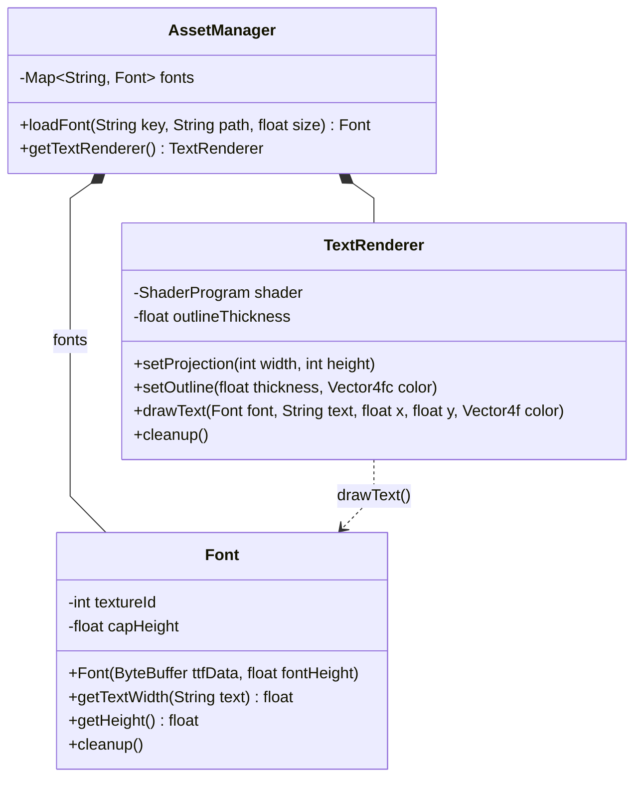
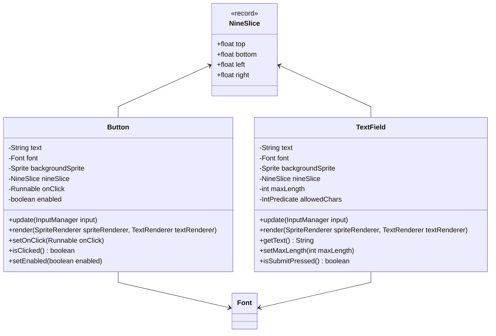

# Class diagram: UI

## Text

```mermaid
%%{init: {"flowchart": {"curve": "linear"}}}%%
classDiagram
    direction TB
    class AssetManager {
        -Map~String, Font~ fonts
        +loadFont(String key, String path, float size) Font
        +getTextRenderer() TextRenderer
    }
    class TextRenderer {
        -ShaderProgram shader
        -float outlineThickness
        +setProjection(int width, int height)
        +setOutline(float thickness, Vector4fc color)
        +drawText(Font font, String text, float x, float y, Vector4f color)
        +cleanup()
    }
    class Font {
        -int textureId
        -float capHeight
        +Font(ByteBuffer ttfData, float fontHeight)
        +getTextWidth(String text) float
        +getHeight() float
        +cleanup()
    }

    AssetManager *-- TextRenderer
    AssetManager *-- Font : fonts
    TextRenderer ..> Font : drawText()
```

## UI controls

```mermaid
%%{init: {"flowchart": {"curve": "linear"}}}%%
classDiagram
    direction TB
    class Button {
        -String text
        -Font font
        -Sprite backgroundSprite
        -NineSlice nineSlice
        -Runnable onClick
        -boolean enabled
        +update(InputManager input)
        +render(SpriteRenderer spriteRenderer, TextRenderer textRenderer)
        +setOnClick(Runnable onClick)
        +isClicked() boolean
        +setEnabled(boolean enabled)
    }
    class TextField {
        -String text
        -Font font
        -Sprite backgroundSprite
        -NineSlice nineSlice
        -int maxLength
        -IntPredicate allowedChars
        +update(InputManager input)
        +render(SpriteRenderer spriteRenderer, TextRenderer textRenderer)
        +getText() String
        +setMaxLength(int maxLength)
        +isSubmitPressed() boolean
    }
    class Font
    class NineSlice {
        <<record>>
        +float top
        +float bottom
        +float left
        +float right
    }

    NineSlice <-- Button
    NineSlice <-- TextField
    Button --> Font
    TextField --> Font
```
