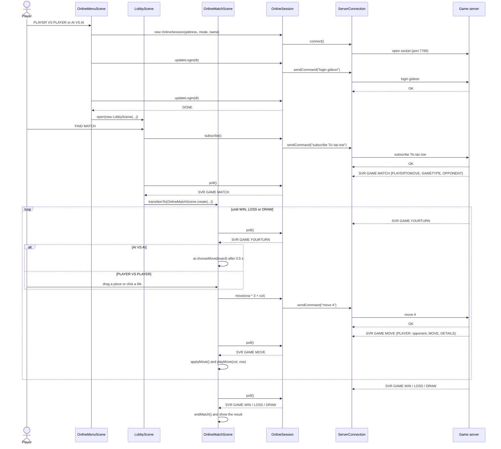

# Sequence diagram: online match

```mermaid
sequenceDiagram
    actor P as Player
    participant Menu as OnlineMenuScene
    participant Lobby as LobbyScene
    participant Match as OnlineMatchScene
    participant S as OnlineSession
    participant C as ServerConnection
    participant G as Game server

    P->>Menu: PLAYER VS PLAYER or AI VS AI
    Menu->>S: new OnlineSession(address, mode, name)
    S->>C: connect()
    C->>G: open socket (port 7789)
    Menu->>S: updateLogin(dt)
    S->>C: sendCommand("login gideon")
    C->>G: login gideon
    G-->>C: OK
    Menu->>S: updateLogin(dt)
    S-->>Menu: DONE
    Menu->>Lobby: open(new LobbyScene(...))

    P->>Lobby: FIND MATCH
    Lobby->>S: subscribe()
    S->>C: sendCommand("subscribe Tic-tac-toe")
    C->>G: subscribe Tic-tac-toe
    G-->>C: OK
    G-->>C: SVR GAME MATCH {PLAYERTOMOVE, GAMETYPE, OPPONENT}
    Lobby->>S: poll()
    S-->>Lobby: SVR GAME MATCH
    Lobby->>Match: transitionTo(OnlineMatchScene.create(...))

    loop until WIN, LOSS or DRAW
        G-->>C: SVR GAME YOURTURN
        Match->>S: poll()
        S-->>Match: SVR GAME YOURTURN
        alt AI VS AI
            Match->>Match: ai.chooseMove(board) after 0.5 s
        else PLAYER VS PLAYER
            P->>Match: drag a piece or click a tile
        end
        Match->>S: move(row * 3 + col)
        S->>C: sendCommand("move 4")
        C->>G: move 4
        G-->>C: OK
        G-->>C: SVR GAME MOVE {PLAYER: opponent, MOVE, DETAILS}
        Match->>S: poll()
        S-->>Match: SVR GAME MOVE
        Match->>Match: applyMove() and playMove(col, row)
    end

    G-->>C: SVR GAME WIN / LOSS / DRAW
    Match->>S: poll()
    S-->>Match: SVR GAME WIN / LOSS / DRAW
    Match->>Match: endMatch() and show the result
```
