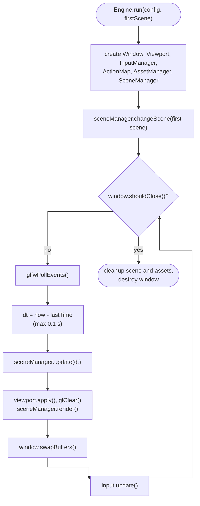
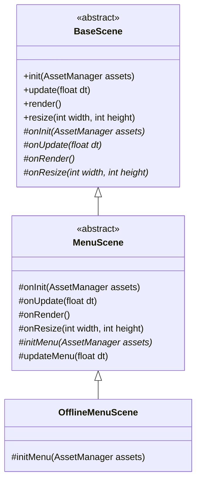
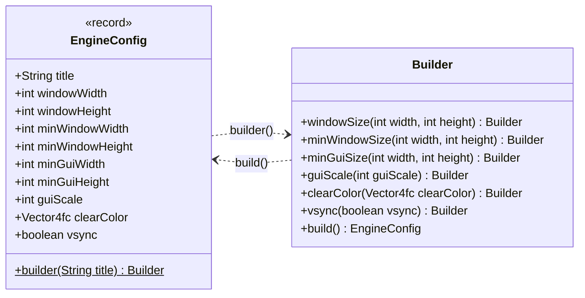
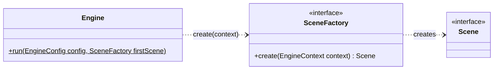
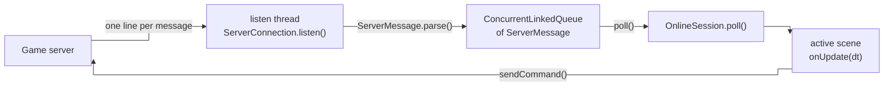

# Design patterns

## Game loop

```mermaid
%%{init: {"flowchart": {"curve": "stepAfter"}}}%%
flowchart TB
    start(["Engine.run(config, firstScene)"])
    setup["create Window, Viewport, InputManager,<br/>ActionMap, AssetManager, SceneManager"]
    first["sceneManager.changeScene(first scene)"]
    check{"window.shouldClose()?"}
    poll["glfwPollEvents()"]
    dt["dt = now - lastTime<br/>(max 0.1 s)"]
    update["sceneManager.update(dt)"]
    render["viewport.apply(), glClear()<br/>sceneManager.render()"]
    swap["window.swapBuffers()"]
    input["input.update()"]
    stop(["cleanup scene and assets,<br/>destroy window"])

    start --> setup --> first --> check
    check -->|no| poll
    poll --> dt --> update --> render --> swap --> input
    input --> check
    check -->|yes| stop
```

## Template method

```mermaid
%%{init: {"flowchart": {"curve": "linear"}}}%%
classDiagram
    direction TB
    class BaseScene {
        <<abstract>>
        +init(AssetManager assets)
        +update(float dt)
        +render()
        +resize(int width, int height)
        #onInit(AssetManager assets)*
        #onUpdate(float dt)*
        #onRender()*
        #onResize(int width, int height)*
    }
    class MenuScene {
        <<abstract>>
        #onInit(AssetManager assets)
        #onUpdate(float dt)
        #onRender()
        #onResize(int width, int height)
        #initMenu(AssetManager assets)*
        #updateMenu(float dt)
    }
    class OfflineMenuScene {
        #initMenu(AssetManager assets)
    }
    BaseScene <|-- MenuScene
    MenuScene <|-- OfflineMenuScene
```

## Builder

```mermaid
%%{init: {"flowchart": {"curve": "linear"}}}%%
classDiagram
    direction LR
    class EngineConfig {
        <<record>>
        +String title
        +int windowWidth
        +int windowHeight
        +int minWindowWidth
        +int minWindowHeight
        +int minGuiWidth
        +int minGuiHeight
        +int guiScale
        +Vector4fc clearColor
        +boolean vsync
        +builder(String title)$ Builder
    }
    class Builder {
        +windowSize(int width, int height) Builder
        +minWindowSize(int width, int height) Builder
        +minGuiSize(int width, int height) Builder
        +guiScale(int guiScale) Builder
        +clearColor(Vector4fc clearColor) Builder
        +vsync(boolean vsync) Builder
        +build() EngineConfig
    }
    EngineConfig ..> Builder : builder()
    Builder ..> EngineConfig : build()
```

## Factory

```mermaid
%%{init: {"flowchart": {"curve": "linear"}}}%%
classDiagram
    direction LR
    class Engine {
        +run(EngineConfig config, SceneFactory firstScene)$
    }
    class SceneFactory {
        <<interface>>
        +create(EngineContext context) Scene
    }
    class Scene {
        <<interface>>
    }
    Engine ..> SceneFactory : create(context)
    SceneFactory ..> Scene : creates
```

## Producer-consumer

```mermaid
%%{init: {"flowchart": {"curve": "stepAfter"}}}%%
flowchart LR
    server["Game server"]
    thread["listen thread<br/>ServerConnection.listen()"]
    queue["ConcurrentLinkedQueue<br/>of ServerMessage"]
    session["OnlineSession.poll()"]
    scene["active scene<br/>onUpdate(dt)"]

    server -->|"one line per message"| thread
    thread -->|"ServerMessage.parse()"| queue
    queue -->|"poll()"| session
    session --> scene
    scene -->|"sendCommand()"| server
```
