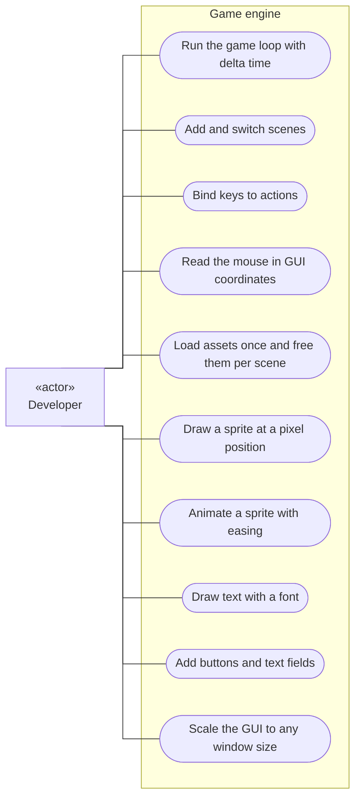
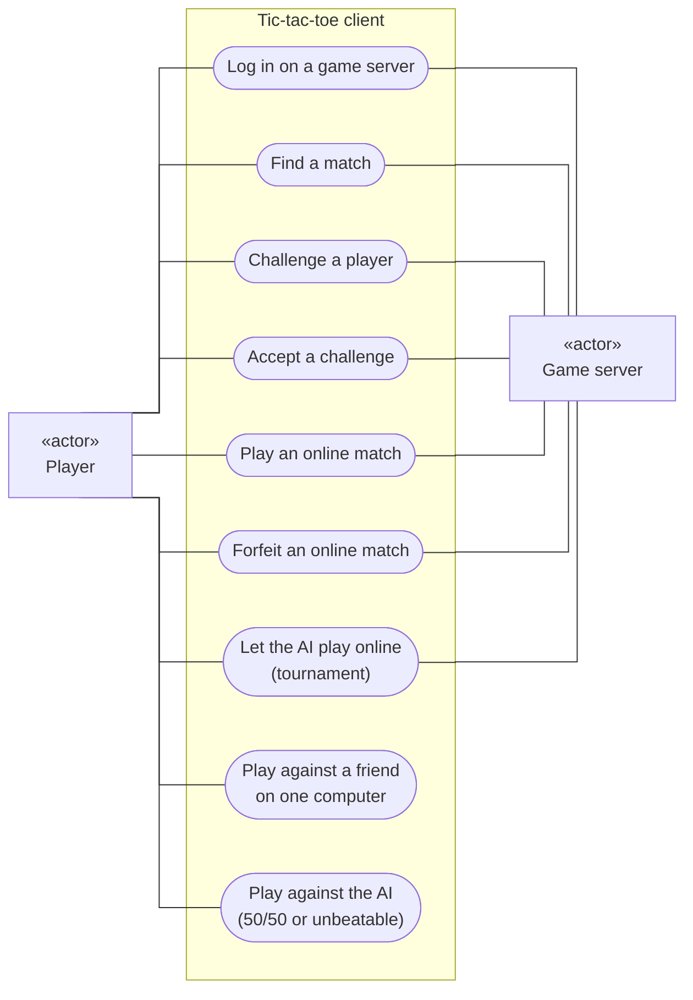

# Use cases

## Engine

```mermaid
%%{init: {"flowchart": {"curve": "stepAfter"}}}%%
flowchart LR
    dev["«actor»<br/>Developer"]

    subgraph engine ["Game engine"]
        direction TB
        uc1(["Run the game loop with delta time"])
        uc2(["Add and switch scenes"])
        uc3(["Bind keys to actions"])
        uc4(["Read the mouse in GUI coordinates"])
        uc5(["Load assets once and free them per scene"])
        uc6(["Draw a sprite at a pixel position"])
        uc7(["Animate a sprite with easing"])
        uc8(["Draw text with a font"])
        uc9(["Add buttons and text fields"])
        uc10(["Scale the GUI to any window size"])
    end

    dev --- uc1
    dev --- uc2
    dev --- uc3
    dev --- uc4
    dev --- uc5
    dev --- uc6
    dev --- uc7
    dev --- uc8
    dev --- uc9
    dev --- uc10
```

## Tic-tac-toe

```mermaid
%%{init: {"flowchart": {"curve": "stepAfter"}}}%%
flowchart LR
    player["«actor»<br/>Player"]

    subgraph client ["Tic-tac-toe client"]
        direction TB
        uc3(["Log in on a game server"])
        uc4(["Find a match"])
        uc5(["Challenge a player"])
        uc6(["Accept a challenge"])
        uc7(["Play an online match"])
        uc8(["Forfeit an online match"])
        uc9(["Let the AI play online<br/>(tournament)"])
        uc1(["Play against a friend<br/>on one computer"])
        uc2(["Play against the AI<br/>(50/50 or unbeatable)"])
    end

    server["«actor»<br/>Game server"]

    player --- uc3
    player --- uc4
    player --- uc5
    player --- uc6
    player --- uc7
    player --- uc8
    player --- uc9
    player --- uc1
    player --- uc2

    uc3 --- server
    uc4 --- server
    uc5 --- server
    uc6 --- server
    uc7 --- server
    uc8 --- server
    uc9 --- server
```
